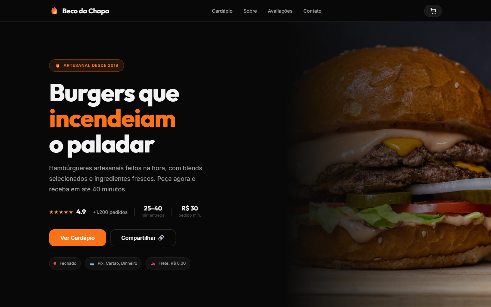
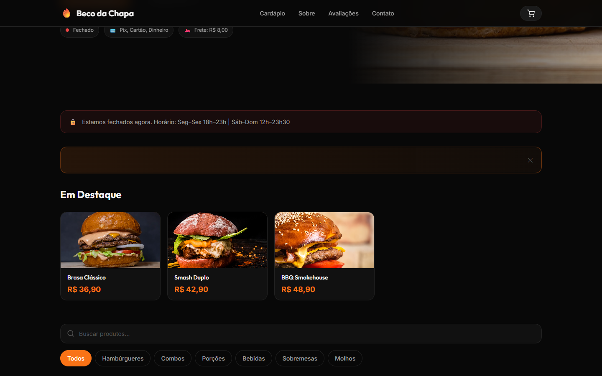
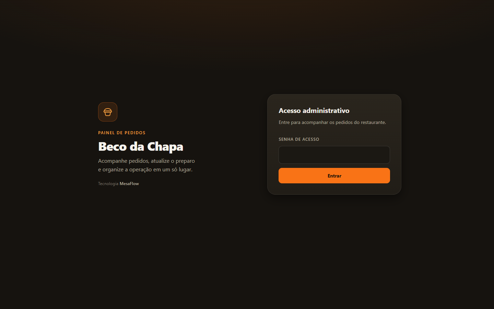
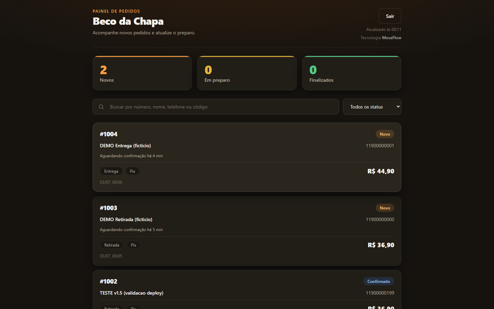
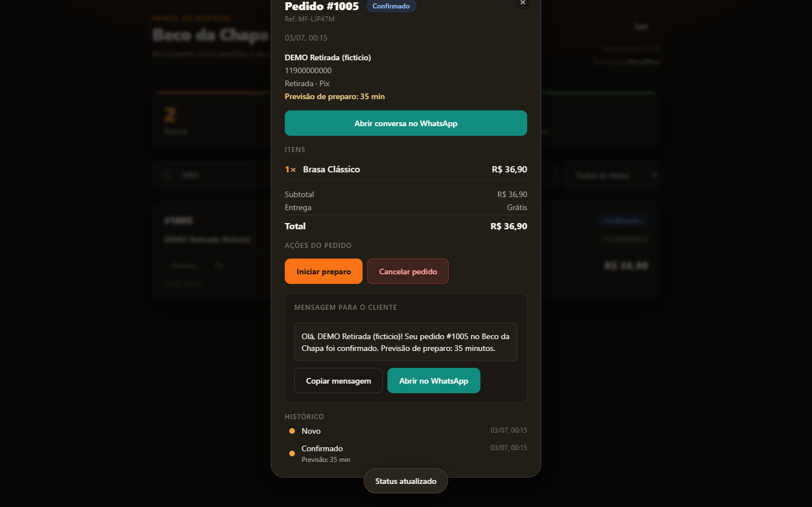
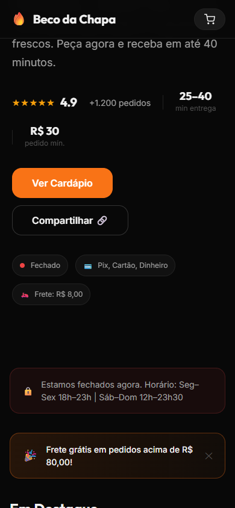
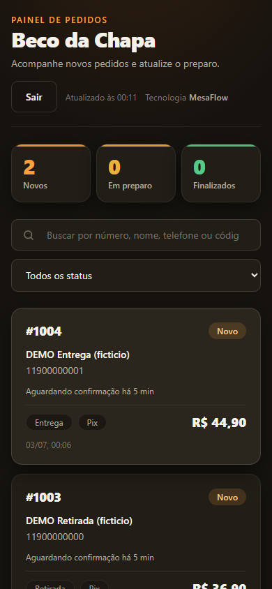
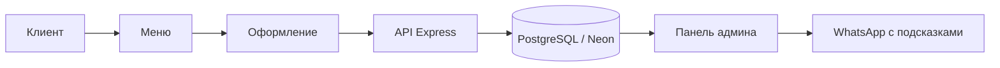

# MesaFlow — система прямых заказов для заведений

Сайт, меню, оформление заказа, сохраняемые заказы и операционная панель, чтобы заведение
принимало заказы через **собственный канал** — без комиссии маркетплейса на заказах,
сделанных через собственный канал. Клиент выбирает, настраивает и оформляет; заказ
сохраняется в базе и ведётся через административную панель с пошаговым сценарием и
подсказками для общения в WhatsApp.

**Демо:** кофейня **«Зёрна»** — обжарка кофе (вымышленный бренд для демонстрации;
контакты, адрес и телефоны вымышленные).

---

## Ссылки

- **Публичное демо:** https://qr-menu-coffee.vercel.app
- **Административная панель:** https://qr-menu-coffee.vercel.app/admin (вход по паролю; пароль не публичный)
- **Репозиторий:** https://github.com/RhanielRodri/mesaflow-menu

---

## Галерея

| | |
|---|---|
|  |  |
|  |  |
|  | |

| Мобильная — меню | Мобильная — панель |
|---|---|
|  |  |

---

## Возможности для клиента

- Меню по категориям
- Поиск в реальном времени (с нормализацией регистра) и избранное
- Корзина с количеством, строками кастомизации, итогом и прогрессом до бесплатной доставки
- Настройка по позиции (убрать ингредиенты, платные добавки и размер стакана
  только у совместимых позиций)
- Самовывоз или доставка, с условным полем адреса
- Оплата через Kaspi, картой или наличными, с условным полем сдачи
- Человекочитаемый номер заказа (напр.: **#1042**) в подтверждении и в сообщении
- Дополнение через WhatsApp: оформление формирует отформатированное сообщение со сводкой заказа

---

## Операционные возможности (панель `/admin`)

- Панель под паролем (JWT с короткой сессией)
- Упорядоченная очередь заказов, карточки-сводки (Новые / Готовятся / Завершены)
- Ненавязчивое уведомление о новых заказах и время ожидания подтверждения
- Время приготовления при подтверждении (в минутах)
- Пошаговый сценарий по типу получения:
  - **Самовывоз:** Новый → Подтверждён → Готовится → Готов → Завершён
  - **Доставка:** Новый → Подтверждён → Готовится → Готов → В доставке → Завершён
- История статусов только на добавление, с временем и причиной, где применимо
- Отмена с обязательной причиной, фиксируется в истории
- Помощь в общении: сообщение по статусу готово для **копирования** или **открытия в WhatsApp**
  (отправка всегда ручная — система никогда не отправляет и не утверждает, что клиент оповещён)
- Поиск по номеру, `#номеру`, имени, телефону или техническому коду
- Адаптивная вёрстка (десктоп и мобильные)

---

## Поток

```
Клиент → меню → оформление → API → PostgreSQL → панель → WhatsApp с подсказками
```



Человекочитаемый номер заказа генерируется атомарно для каждого заведения в момент создания;
технический код `MF-XXXXXX` сохраняется как внутренняя ссылка.

---

## Архитектура

- **Статичный фронтенд:** HTML, CSS и модульный JavaScript (нативные ES Modules), без фреймворка
  и без сборки — публикуется на **Vercel**.
- **Бэкенд:** Node.js + Express + Prisma 6, размещён на **Render**.
- **База:** PostgreSQL на **Neon** (денежные значения всегда в целых тиынах).
- **Модели:** `Restaurant`, `Category`, `Product`, `Order`, `OrderItem`, `OrderStatusHistory`.

---

## Безопасность

- Административные маршруты защищены **JWT** с коротким сроком жизни и rate limit на входе.
- Секреты только в переменных окружения (никогда не коммитятся).
- В демо используются исключительно вымышленные данные.
- Пароль панели **не** содержится в этом репозитории и в README.

---

## Структура репозитория

```
CardapioPro/
├── index.html            публичный сайт (меню + оформление заказа)
├── admin/                операционная панель (вход, очередь, детали, общение)
├── src/                  модули фронтенда (data, cart, customize, checkout, ui, api…)
├── styles/               токены дизайна и стили
├── assets/               изображения, favicon
├── backend/              API Express + Prisma
│   ├── src/              app, маршруты (health, public menu, orders, admin), middlewares
│   └── prisma/           schema, миграции и идемпотентный seed
├── docs/screenshots/     скриншоты для галереи
└── render.yaml           blueprint деплоя API на Render
```

---

## Как запустить локально

**Фронтенд** (ES Modules требуют HTTP-сервер):

```bash
npx serve .            # внутри produtos/CardapioPro
```

В локальном окружении фронтенд автоматически указывает на API по адресу `http://localhost:3333`.

**Бэкенд** (API + база):

```bash
cd backend
cp .env.example .env          # заполните переменные (см. ниже)
npm install
npm run prisma:generate
npm run prisma:migrate
npm run seed
npm run dev                   # поднимает API на http://localhost:3333
```

Seed переиспользует `src/data.js` как единственный источник меню и идемпотентен.

---

## Переменные окружения

Только имена (значения задайте в своём окружении / панели деплоя):

```
DATABASE_URL
ADMIN_PASSWORD
ADMIN_JWT_SECRET
FRONTEND_URL
PORT
```

---

## Область применения

MesaFlow — это **собственный канал заказов** для заведения. Это не прямая замена
агрегаторам доставки: идея в том, чтобы дать заведению канал, где оно принимает заказы
**без комиссии маркетплейса на заказах, сделанных через собственный канал**, с собственной
операционной панелью.

### Вне текущей области

Склад, финансы, POS, QR по столам, официальный WhatsApp API, экран кухни, несколько
пользователей и мультиаккаунт.

---

Портфолио-проект и переиспользуемая основа для заведений.
