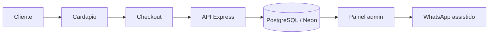

# MesaFlow — Sistema de pedidos diretos para restaurantes

Site, cardápio, checkout, pedidos persistidos e painel operacional para o restaurante
receber pedidos pelo **próprio canal** — sem comissão de marketplace nos pedidos feitos
pelo próprio canal. O cliente escolhe, personaliza e finaliza; o pedido é registrado em
banco e acompanhado por um painel administrativo com fluxo guiado e comunicação assistida
por WhatsApp.

**Demo:** **Beco da Chapa** — hamburgueria artesanal (marca fictícia para demonstração;
contatos, endereço e telefones são fictícios).

---

## Links

- **Demo pública:** https://mesaflow-menu.vercel.app
- **Painel administrativo:** https://mesaflow-menu.vercel.app/admin (acesso por senha; a senha não é pública)
- **Repositório:** https://github.com/RhanielRodri/mesaflow-menu

---

## Galeria

| | |
|---|---|
|  |  |
|  |  |
|  | |

| Mobile — cardápio | Mobile — painel |
|---|---|
|  |  |

---

## Funcionalidades para o cliente

- Cardápio por categorias
- Busca em tempo real (com normalização de acentos) e favoritos
- Carrinho com quantidades, linhas de personalização, total e frete grátis progressivo
- Personalização por produto (remover ingredientes, adicionais com preço e ponto da carne
  apenas nos produtos compatíveis)
- Retirada ou entrega, com endereço condicional
- Pagamento por Pix, cartão ou dinheiro, com troco condicional
- Número humano do pedido (ex.: **#1042**) na confirmação e na mensagem
- WhatsApp complementar: o checkout monta uma mensagem formatada com o resumo do pedido

---

## Funcionalidades operacionais (painel `/admin`)

- Painel protegido por senha (JWT de sessão curta)
- Fila de pedidos ordenada, com cards de resumo (Novos / Em preparo / Finalizados)
- Alerta discreto de novos pedidos e tempo de espera dos pedidos aguardando confirmação
- Previsão de preparo ao confirmar (em minutos)
- Fluxo guiado por tipo de entrega:
  - **Retirada:** Novo → Confirmado → Em preparo → Pronto → Finalizado
  - **Entrega:** Novo → Confirmado → Em preparo → Pronto → Saiu para entrega → Finalizado
- Histórico de status append-only, com previsão e motivo quando aplicável
- Cancelamento com motivo obrigatório, registrado na timeline
- Comunicação assistida: mensagem por status pronta para **copiar** ou **abrir no WhatsApp**
  (o envio é sempre manual — o sistema nunca envia nem afirma que o cliente foi avisado)
- Busca por número, `#número`, nome, telefone ou código técnico
- Layout responsivo (desktop e mobile)

---

## Fluxo

```
Cliente → cardápio → checkout → API → PostgreSQL → painel → WhatsApp assistido
```



O número humano do pedido é gerado de forma atômica por restaurante no momento da criação;
o código técnico `MF-XXXXXX` continua salvo como referência interna.

---

## Arquitetura

- **Frontend estático:** HTML, CSS e JavaScript modular (ES Modules nativos), sem framework
  e sem build — publicado na **Vercel**.
- **Backend:** Node.js + Express + Prisma 6, hospedado no **Render**.
- **Banco:** PostgreSQL no **Neon** (valores monetários sempre em centavos inteiros).
- **Modelos:** `Restaurant`, `Category`, `Product`, `Order`, `OrderItem`, `OrderStatusHistory`.

---

## Segurança

- Rotas administrativas protegidas por **JWT** de expiração curta e rate limit no login.
- Segredos apenas em variáveis de ambiente (nunca versionados).
- A demo usa exclusivamente dados fictícios.
- A senha do painel **não** consta neste repositório nem no README.

---

## Estrutura do repositório

```
CardapioPro/
├── index.html            site público (cardápio + checkout)
├── admin/                painel operacional (login, fila, detalhe, comunicação)
├── src/                  módulos do frontend (data, cart, customize, checkout, ui, api…)
├── styles/               design tokens e estilos
├── assets/               imagens, favicon
├── backend/              API Express + Prisma
│   ├── src/              app, rotas (health, public menu, orders, admin), middlewares
│   └── prisma/           schema, migrations e seed idempotente
├── docs/screenshots/     capturas usadas na galeria
└── render.yaml           blueprint de deploy da API no Render
```

---

## Como rodar localmente

**Frontend** (ES Modules exigem servidor HTTP):

```bash
npx serve .            # dentro de produtos/CardapioPro
```

Em ambiente local o frontend aponta automaticamente para a API em `http://localhost:3333`.

**Backend** (API + banco):

```bash
cd backend
cp .env.example .env          # preencha as variáveis (ver abaixo)
npm install
npm run prisma:generate
npm run prisma:migrate
npm run seed
npm run dev                   # sobe a API em http://localhost:3333
```

O seed reutiliza `src/data.js` como fonte única do cardápio e é idempotente.

---

## Variáveis de ambiente

Apenas os nomes (defina os valores no seu ambiente / painel de deploy):

```
DATABASE_URL
ADMIN_PASSWORD
ADMIN_JWT_SECRET
FRONTEND_URL
PORT
```

---

## Multi-estabelecimento (multi-tenant)

O design (layout, componentes e CSS) é **compartilhado** entre todos os
estabelecimentos. O que muda por loja fica isolado em um módulo de dados:

```
src/tenants/
├── index.js            registro dos estabelecimentos (slug -> loader)
├── _TEMPLATE.js        modelo para abrir um novo estabelecimento
└── beco-da-chapa.js    marca, cardápio, preços e textos da loja
```

O estabelecimento ativo é resolvido **em runtime pelo subdomínio**
(`beco.seu-dominio.kz` → slug `beco`), com override `?r=<slug>` para testar em
localhost/preview. `src/data.js` carrega o tenant correspondente e o restante do
frontend não muda. A marca (logo, nome, cor de destaque, moeda) é aplicada em
runtime a partir do próprio módulo.

O mesmo módulo é a **fonte única**: o seed do backend
(`backend/prisma/seed.js`) percorre o registro e popula um `Restaurant` por
estabelecimento no banco, com seu cardápio e preços.

**Para abrir uma nova cafeteria:**

1. copie `src/tenants/_TEMPLATE.js` para `src/tenants/<slug>.js` e preencha
   marca, contatos, categorias, produtos e preços;
2. registre o slug em `src/tenants/index.js`;
3. aponte o subdomínio `<slug>.seu-dominio` para o mesmo deploy;
4. rode `npm run seed` no backend para popular o banco desse estabelecimento.

Nenhuma alteração de layout ou CSS é necessária por loja.

---

## Escopo

MesaFlow é um **canal próprio de pedidos** para o restaurante. Não é um substituto direto
do iFood: a proposta é dar ao restaurante um canal onde ele recebe pedidos **sem comissão
de marketplace nos pedidos feitos pelo próprio canal**, com painel operacional próprio.

### Fora do escopo atual

Estoque, financeiro, PDV, QR por mesa, WhatsApp API oficial, tela de cozinha, múltiplos
usuários e multiempresa.

---

Projeto de portfólio e base reutilizável para restaurantes.
